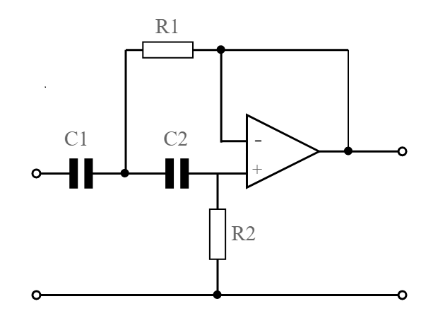
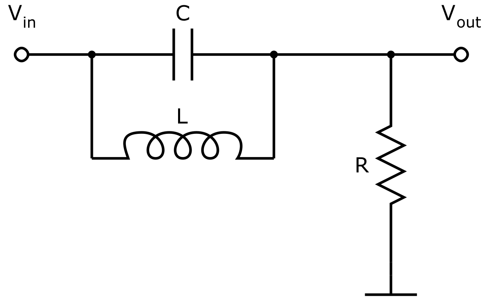

# << Calculadora de Filtros >>

## << Descrição breve do domínio do problema >>

	Neste projeto final da disciplina de Programação Orientada a Objetos visa-se desenvolver um programa em C++ para automatizar o cálculo e análise de 
filtros eletrônicos, proporcionando uma ferramenta eficiente e precisa. Para contexto, os filtros podem ter por exemplo os seguintes formatos: 

	<figure>
		
		<figcaption>Filtro Passa-Baixa ativo</figcaption>
	</figure>
	<figure>
		
		<figcaption>Filtro Rejeita-Faixa passivo</figcaption>
	</figure>	 

> Repositório destinado para o desenvolvimento do projeto final da disciplina 
> PRG22107 - Programação orientada objeto. 
> 
> Aluno: << Christopher Costa >>  
> Professor: Hugo Marcondes

<strong>SUMÁRIO</strong>

[**1. ANÁLISE ORIENTADA A OBJETO**](./analise.md) 
[**2. PROJETO ORIENTADO A OBJETO**](./projeto.md) 
[**3. IMPLEMENTAÇÃO (C++)**](./implementacao.md) 
[**4. TESTES**](./testes.md) 