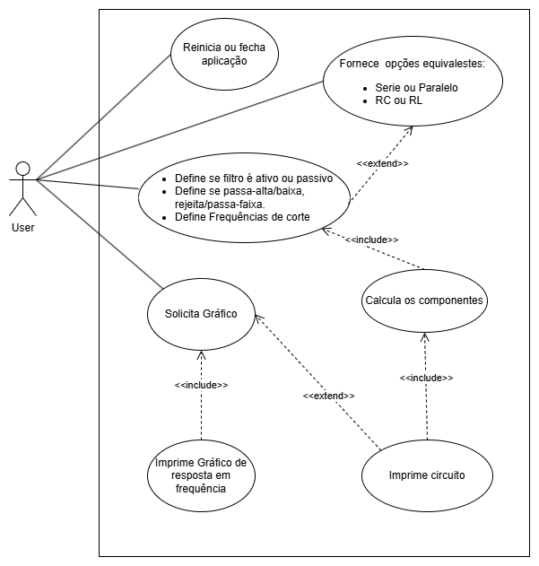
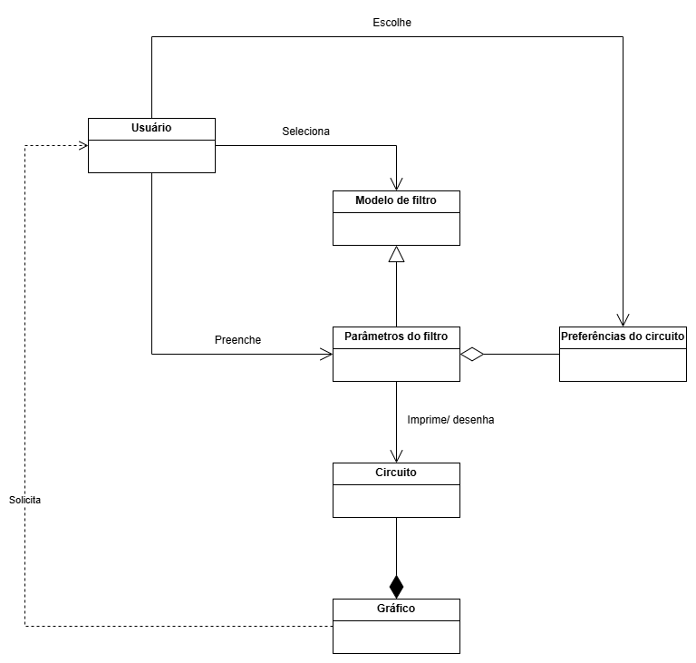

# Análise orientada a objeto
> [!NOTE]
> 
A <strong>análise</strong> orientada a objeto consiste na descrição do 
> problema a ser tratado, duas primeiras etapas da tabela abaixo, a definição de 
> casos de uso e a definição do domínio do problema.

## Descrição Geral do domínio do problema

		O programa deve fornecer, a partir da entrada do usuário, um desenho do 
circuito de filtro de frequências, explicitando o valor de todos os componentes,
e ainda plotar um gráfico com a resposta em frequência do mesmo. 

	A entrada do usuário deve conter:

<ul>
	<li> Modelo do filtro: passivo/ ativo</li>
	<li> Tipo do filtro: Passa-Alta; Passa-Baixa; Passa-Faixa; Rejeita_Faixa</li>
	<li> Frequências de corte: Inferior/ Superior/ Central</li>
	<li> Preferência por componentes: indutores/ capacitores</li>
	<li> Preferência por cicuito em série ou paralelo</li>
</ul>

## Diagrama de Casos de Uso

O diagrama de caso de uso apresentado abaixo indica os seguinte procecesso, 
partindo das três interaçoes possíveis com o usuário:

<ul>
	<li> Reinicia ou fecha aplicação. </li>
	<li> Indica modelo e parâmetros do filtro. </li>
</ul>
	<ol>
		<li> Programa pergunta preferência por circuito serie/paralelo ou com uso de RC ou RL.
		 Somente se há opções equivalentes disponíveis.</li>
		<li> Calcula valor dos componentes comforme parâmetros passados. </li>
		<li> Imprime circuito com todos os componentes definidos.</li>
	</ol>
<ul>
	<li> Solicita gráfico. Obs: Esta opção somente é apresentada quando o circuito
	já foi desenhado.</li>
</ul>
	<ol>
		<li> Imprime gráfico de resposta em frequência. </li>
	</ol>

	<figure>
		
		<figcaption></figcaption>
	</figure>

 
## Diagrama de Domínio do problema

		O diagrama de domínio da aplicação é apresentado na figura abaixo.

	<figure>
		
		<figcaption></figcaption>
	</figure>

[Retroceder](README.md) | [Avançar](projeto.md)

