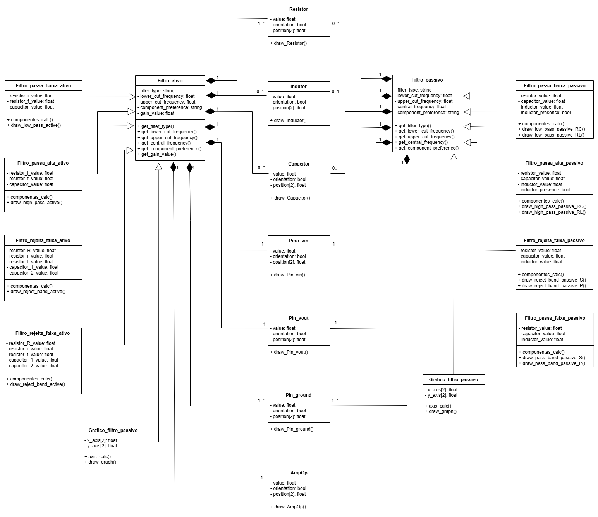
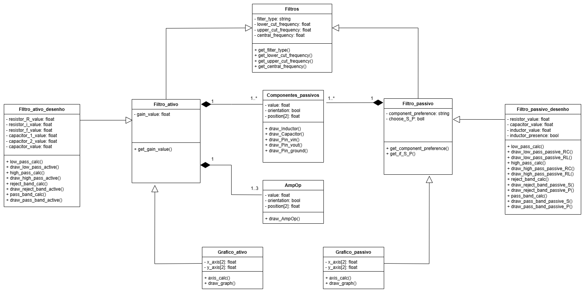
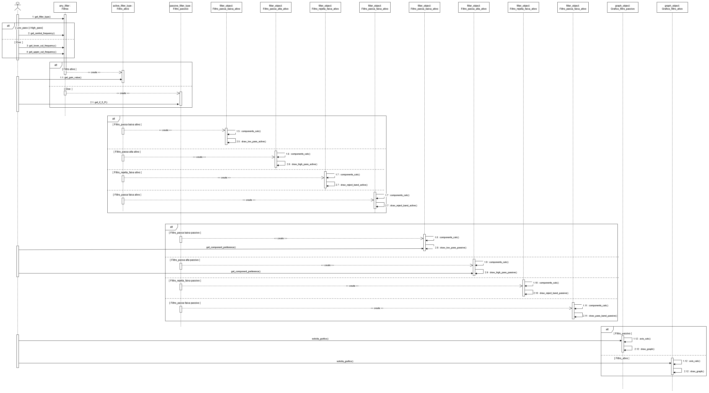
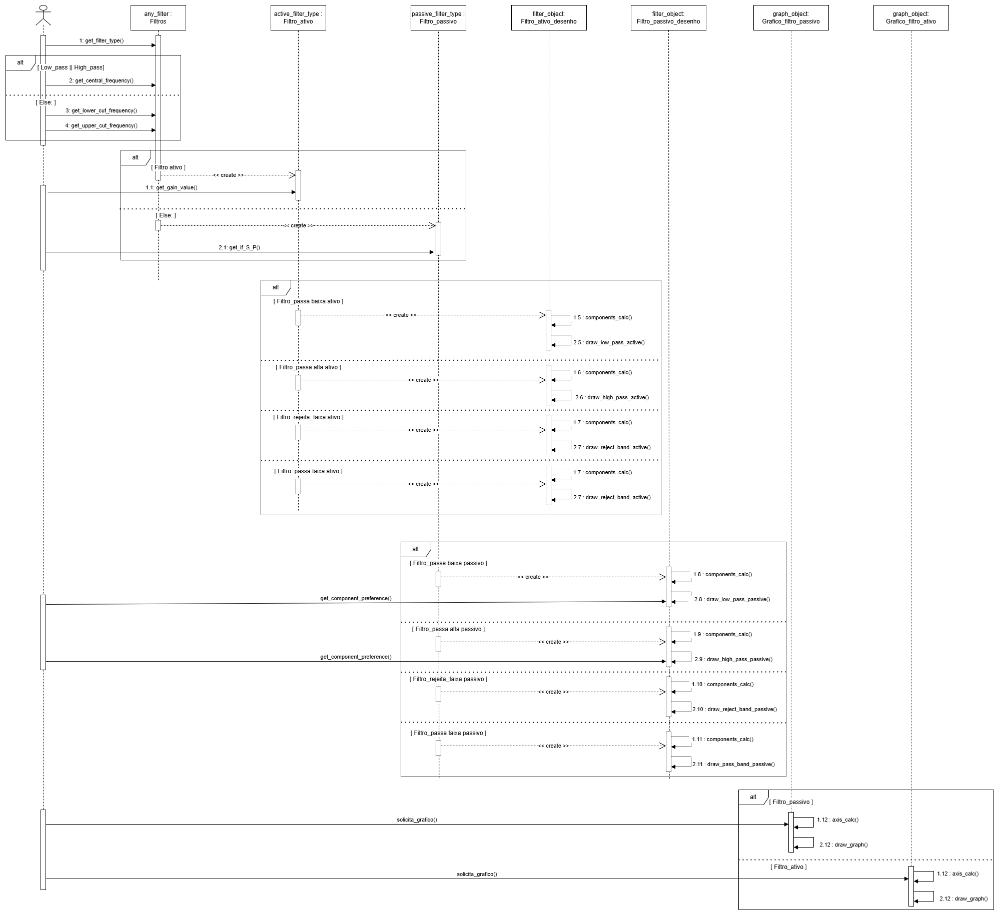

# Projeto orientado a objeto

## << Diagrama de Classes >>

	<figure>
		
		<figcaption></figcaption>
	</figure>

		O diagrama de classes apresentado contém 18 classes relacionadas por
herança e composição. Sendo que somente as classes relacionadas aos componentes
eletrônicos são ligadas as classes Filtro_ativo e Filtro_passivo por composição, 
visto que são as únicas que podem possuir mais de um objeto simultâneo. 

 	No entanto, reconhecendo-se a complexidade do primeiro diagrama, um segundo
foi elaborado, objetivando mais simplicidade, porém com a desvantagem de sobrecarregar 
as classes com muitos métodos, além de que muitos atributos podem não ser usados e as
funções podem ficar mais complexas de implementar, visto que são mais genéricas. O diagrama
 de classe equivalente é apresentado abaixo:

	<figure>
		
		<figcaption></figcaption>
	</figure>

## << Diagramas de Interação >>

### Diagrama de Sequência

		O diagrama de sequência a seguir foi desenhado com base nas classes do primeiro
diagrama de classes apresentado. Portanto, pode ter sua dimensão horizontal dimunuida
com a adoção do segundo diagrama de classe, porém, um segundo desenho é desnecessário,
visto que, a execução de qualquer um dos diagramas produzem os mesmo resultado na tela
do usuário.

 

	<figure>
		
		<figcaption></figcaption>
	</figure>

	O diagrama de sequência abaixo segue as classes do segundo diagrama de classes apresentado.
Percebe-se que, apesar da diferença de dimesões, a execução é a mesma.

	<figure>
		
		<figcaption></figcaption>
	</figure>

[Retroceder](analise.md) | [Avançar](implementacao.md)

