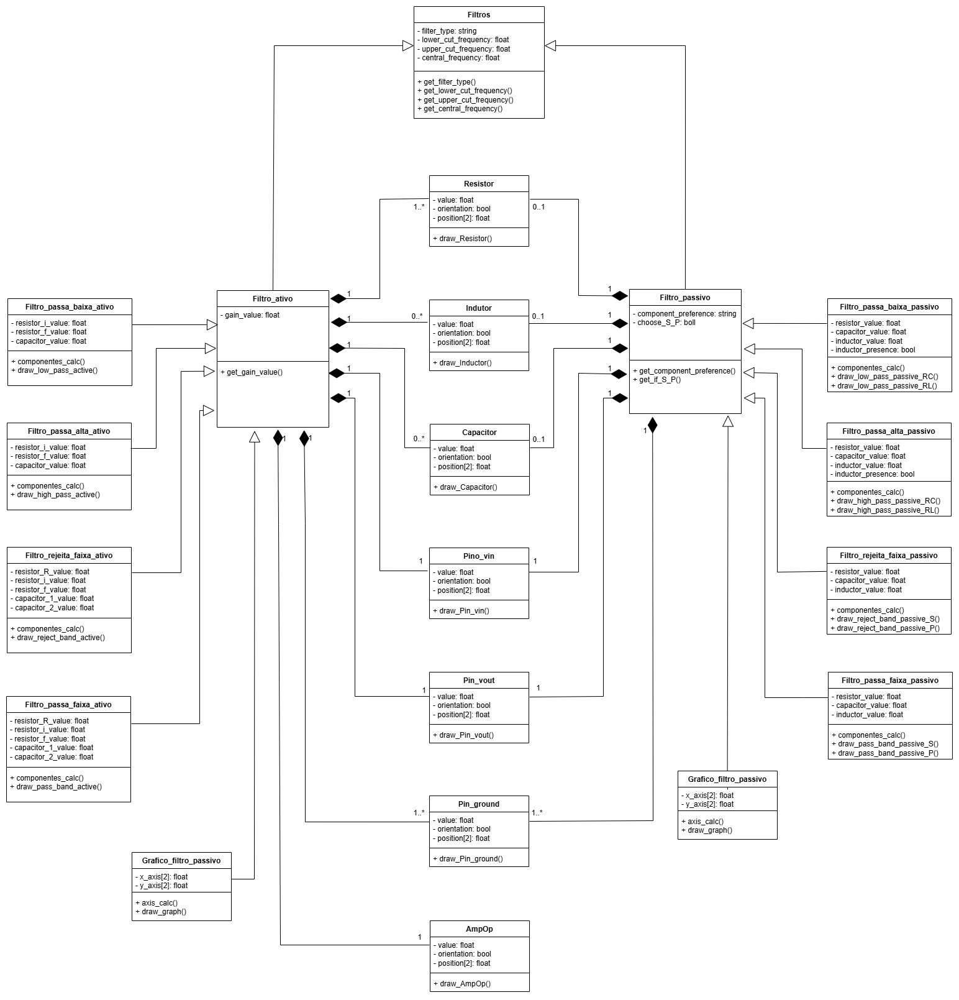

# Projeto orientado a objeto

>[!NOTE] 
> O **Projeto orientado a objeto** é composto pelas documentação do
projeto descrito em UML. Deve incluir um Diagrama de Classes do sistema
projetado, e pelo menos um diagrama de interação de um dos casos de uso. Outros
diagramas podem ser apresentados, caso julgue necessário.

## << Diagrama de Classes >>

	<figure>
		
		<figcaption></figcaption>
	</figure>

O diagrama de classes apresentado contém 18 classes relacionadas por
herança e composição. Sendo que somente as classes relacionadas aos componentes
eletrônicos são ligadas as classes Filtro_ativo e Filtro passivo por composição, 
visto que são as únicas que podem possuir mais de um objeto simultâneo. 

[Retroceder](analise.md) | [Avançar](implementacao.md)

